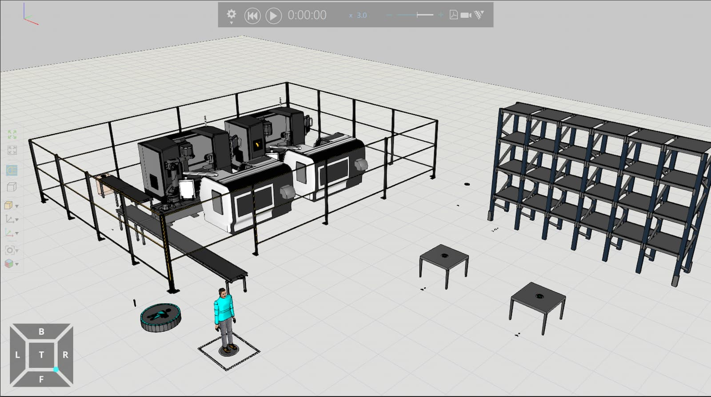

## Giriş

Endüstriyel otomasyon, Robotik ve Dijital İkiz (Digital Twin) alanında yetkinliklerimi geliştirmek için **Visual Components** programını öğrenmeye başladım. Bu yazıda, [Visual Component Academy](https://academy.visualcomponents.com/lessons/introduction-to-layout-configuration/?course=134)'deki Layout Configuration dersini takip ederek oluşturduğum ilk düzenlemeyi paylaşıyorum.

## Neler Yaptım?

Bu çalışmada temel olarak şu adımları uyguladım:

1.  **e-Catalog Kullanımı:** Kütüphaneden konveyör, besleyici (Feeder), eklemli robot (Articulated Robot), torna tezgahı (Lathe), fens (Fence), masa (Table) ve rafların (Warehouse Shelf) sahneye eklenmesi.
2.  **PnP (Plug and Play):** Bileşenlerin birbirine otomatik olarak bağlanması ve hizalanması.
3.  **Layout Düzenleme:** Eklenen bileşenlerin "Clone" ile çoğaltılması, "Move" ile yerleşimlerin ayarlanması, bileşen ayarları (Component Properties) kullanarak bileşenlerin açılarının ayarlanması.
4.  **Process Flow Editor:** Oluşturulan senaryoda prosesin hangi işlem sırası ile gerçekleştirileceğinin ayarlanması.
5.  **Interact:** Sahneye eklenen robotun eksen hareketlerinin mause ile hareket ettirilerek çalışma uzayının (Work Envelope) incelenmesi.
6.  **Statements:** Oluşturulan senaryo kapsamında konveyör hattından gelen Piston Head ile raftan alınan Piston Rod bileşenlerinin, Process Node kullanılarak A masasında montajının yapılması, ardından B masasında son işlemlerin tamamlanarak ürünün sistemden çıkışının sağlanması.
7.  **Simülasyon Testi:** Oluşturulan senaryonun gözlemlenmesi ve hataların giderilmesi.

## Ekran Görüntüsü

Aşağıda kendi oluşturduğum simülasyonun görüntüsü yer almaktadır:



## Simülasyon Adımları

```{=html}
<div style="margin-bottom: 40px; border-radius: 8px; overflow: hidden; box-shadow: 0 4px 15px rgba(0,0,0,0.15);">
  <video class="scroll-video" width="100%" loop muted playsinline preload="metadata" poster="poster.jpg">
    <source src="stage_1.mp4" type="video/mp4">
    <p>Tarayıcınız video etiketini desteklemiyor.</p>
  </video>
</div>

<div style="margin-bottom: 40px; border-radius: 8px; overflow: hidden; box-shadow: 0 4px 15px rgba(0,0,0,0.15);">
  <video class="scroll-video" width="100%" loop muted playsinline preload="metadata" poster="poster_final.jpg">
    <source src="stage_2.mp4" type="video/mp4">
    <p>Tarayıcınız video etiketini desteklemiyor.</p>
  </video>
</div>
```
## Çıkarımlarım (Key Takeaways)

-   Visual Components'in manuel pozisyonlama yerine PnP (Plug and Play) özelliği tasarım sürecini kolaylaştırıyor. Ayrıca "Snap" özelliği ile bileşenleri birbiriyle kolay bir şekilde birleştirilmesini sağlıyor.
-   Visual Components'in içerisinde bulunan e-Catalog ile birçok önemli markalara ait ürünlerin aynı ortamda bulunması gerçek durumları simüle etmeyi kolaylaştırıyor.
-   Process Flow Editor ile, layoutta bulunan bileşenlerin prosesi hangi sıra ve ilişki ile gerçekleştireceği kolay bir şekilde yönetiliyor.
-   İnsan bileşenini de üretim sürecine dahil ederek prosesi daha gelişmiş bir şekilde simüle edilmesini sağlıyor.

------------------------------------------------------------------------

*Kaynak: Bu çalışma [Visual Components Academy](https://academy.visualcomponents.com/) dersleri baz alınarak yapılmıştır.*

```{=html}
<script>
document.addEventListener("DOMContentLoaded", function() {
  const videos = document.querySelectorAll(".scroll-video");
  
  const observer = new IntersectionObserver((entries) => {
    entries.forEach(entry => {
      if (entry.isIntersecting) {
        entry.target.play();
      } else {
        entry.target.pause();
      }
    });
  }, { threshold: 0.5 });

  videos.forEach(video => {
    observer.observe(video);
  });
});
</script>